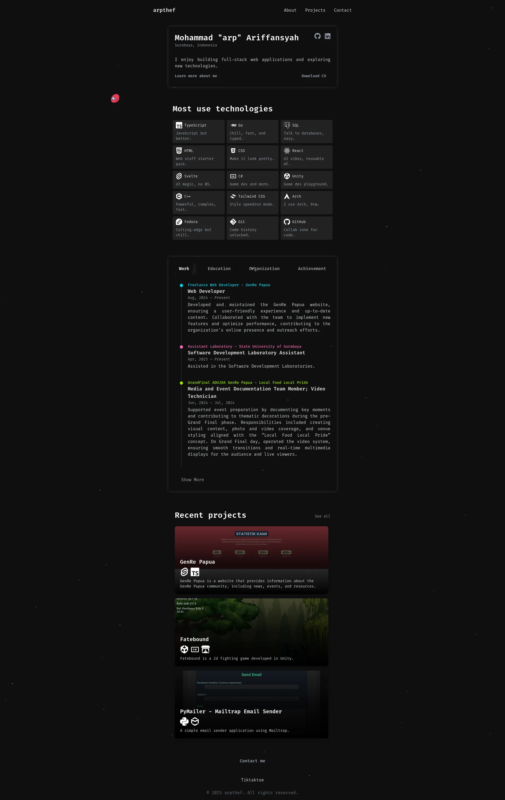
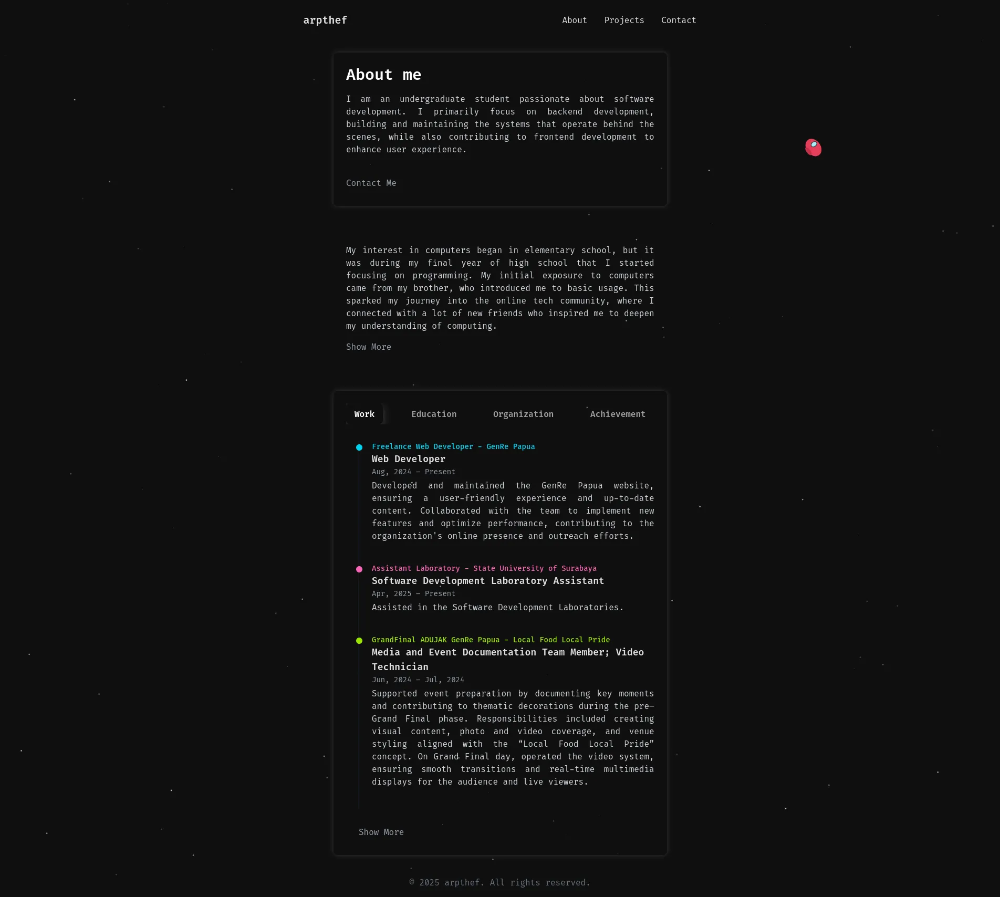
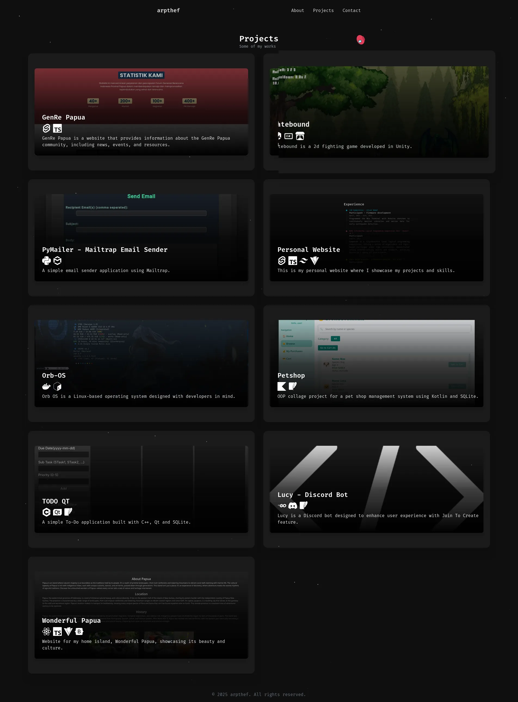
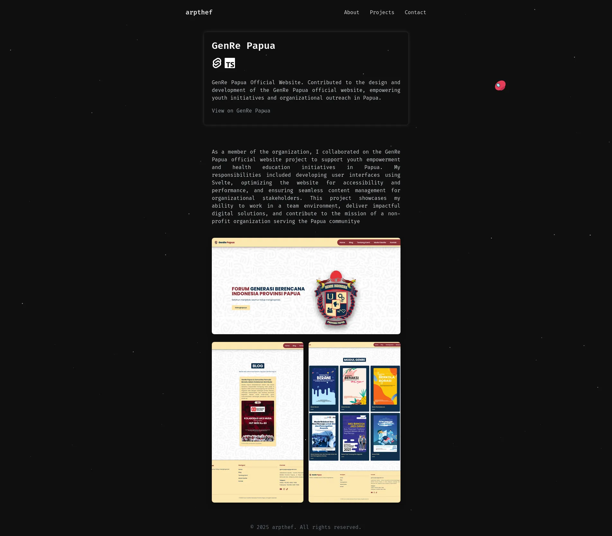
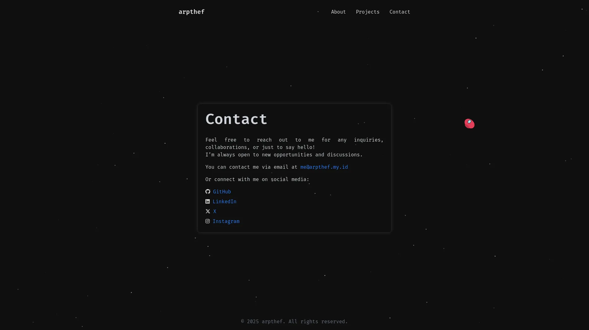

# arpthef - Personal Web Portfolio

Welcome to my personal web portfolio project!  
This repository contains the source code for [arpthef](https://github.com/Ariffansyah/arpthef), built to showcase my work, skills, and background as a developer.

## Tech Stack

- **Framework:** [Svelte](https://svelte.dev/)
- **Languages:** TypeScript, JavaScript, HTML, CSS
- **Runtime & Package Manager:** [Bun](https://bun.sh/)

## Features

- Modern, responsive design
- Interactive components and smooth navigation
- Projects and experience showcased
- Contact information

## Screenshots
|  |  |  |
|------------------------------------------|------------------------------------------|------------------------------------------|
|  |  |                                          |
## Getting Started (with Bun)

To run this project locally using Bun:

```bash
git clone https://github.com/Ariffansyah/arpthef.git
cd arpthef

bun install

bun run dev
```

Then open [http://localhost:5173](http://localhost:5173) in your browser.

## Build

To build for production with Bun:

```bash
bun run build
```

## Learn More

- [Svelte Documentation](https://svelte.dev/docs)
- [TypeScript Handbook](https://www.typescriptlang.org/docs/)
- [Bun Documentation](https://bun.sh/docs)

## About Me

I'm Ariffansyah, a passionate developer interested in web technologies, design, and user experience.  
Feel free to reach out via the contact section of this site or through GitHub issues.

## License

This project is open source and available under the [MIT License](LICENSE).

---

Thank you for visiting my portfolio!
